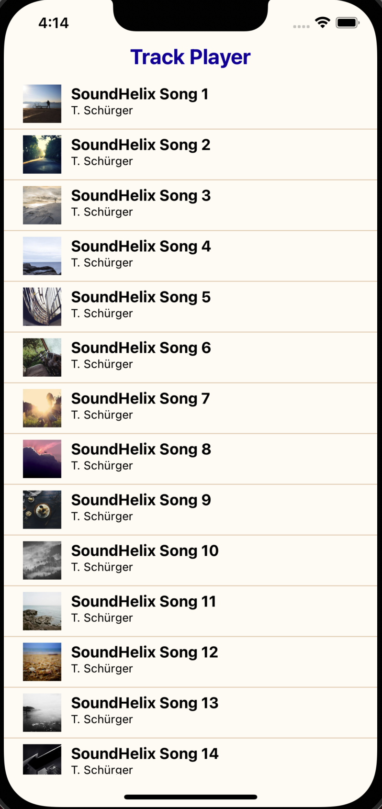

## Local development setup

1. Make sure you have [Xcode 13](https://developer.apple.com/xcode/) - you may need to update your OS to get Xcode 13.
2. Set up the React native environment and install dependencies using [these instructions for React Native CLI](https://reactnative.dev/docs/environment-setup). (You only need to follow the instructions for 1 target, preferably iOS).
3. Install/use node v14.15.x ([nvm](https://github.com/nvm-sh/nvm/blob/master/README.md) is your friend)
4. Install dependencies: `npm install`, then run `pod install` from `/ios` folder
5. To build the app and start the metro server run the `npm start` command from root project directory. You can then choose a device to run on.
6. To run directly on the iOS simulator, run `npm run ios`. To run on the Android simulator the simulator must first be open, then run `npm run android`.

When the app is running correctly, you should see something like this:

